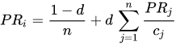

# Page Rank Programm

Bernhard Messerli 
Oktober 2021

## Einführung

Dieses Programm setzt die Aufgabenstellung in Project and Training 2 um.
Folgendes ist die Aufgabenstellung:

Exercise 9: Page Rank

Websites can be represented by a directed graph, where the links are the edges. Page Rank
is an algorithm used to rank the websites by analysing their importance and how they are
connected (https://en.wikipedia.org/wiki/PageRank):

Your Tasks:

a) Create a simple representation in code of a Directed Graph with weighted nodes.

b) Describe in your own word and implement the algorithm for computing the page rank
  of a small example graph.

c) Apply your algorithm to a real world example, not being websites.

## Erklärungen zum Page Rank und zur Implementierung
Der Page Rank ist eine Gewichtung der Nodes. Dabei wird diese Gewichtung stärker, je mehr Edges bei diesem 
Node eingehen. Weiter wird die Gewichtung grösser, wenn Edges eingehen, die selbst ein hohes eigenes
Gewicht haben.

Ich habe in meinem Beispielprogramm folgende Formel von der website: https://en.wikipedia.org/wiki/PageRank
verwendedt.

n ist die Anzahl aller Nodes, d ist ein Korrekturfaktor der zwischen 0 und 1 liegt, PRi ist der Node
der bewertet wird, PRj sind alle eingehenden Nodes und cj ist die Anzahl aller eingehenden Nodes.

Ich habe die Umsetzung so gemacht, dass bei mir die Node-Klasse (T) jeweils eine Liste für die 
eingehenden Nodes und eine Liste für die ausgehenden Nodes hat. Weiter hat jeder Node eine Instanzvariable 
mit der Gewichtung(pageRankValue).

In der Klasse DirectedGraph wird die Struktur gelegt für einen gerichteten, gewichteten Graph.
Die Edge Klasse hilft mir bei der Umsetzung, da es ja um Links geht und jeder Link stellt eine 
Edge dar.
Zusätzlich hilft die Edge Klasse auch Fehler beim Aufbau zu verhindern, da die Nodes dann
nicht mehr vertauscht werden können.

In der PageRank Klasse wird dieser Page Rank Algorihmus umgesetzt und angewandt.
Bei meiner Umsetzung wird der Rekursive Algorithmus n^2 mal angewandt, damit die Werte auf etwa 5 Stellen
nach dem Komma genau sind.

In der App Klasse gibt die main Metode dann die Page Rank Werte für jeden Node absteigend aus.
Weiter werden die Werte aller eingehenden Nodes für jeden Node ausgegeben.

## A real world example
Meine Anwendung zielt auf die Partnervermittlung. Nehmen wir das Beispiel Tinder.
Jeder Benutzer, jede Benutzerin von Tinder stellt einen Node dar. Jedes like stellt eine Edge
dar, wobei der oder die, welche/r geliked wird, bekommt so ein höheres eigenes Gewicht.
Wird eine Person von einer anderen Person geliked wird, die ein hohes eigenes Gewicht hat, ist es noch 
besser.
Mögliche Anwendungen davon sind:
Es kann ein Ranking von den am meisten gelikten Personen erstellt werden. Und dies wird auch 
gemacht.(Top-Picks)
Weiter wäre es so möglich Personen Zielpersonen darzustellen, die ein ähnliches Gewicht haben.
Personen treffen also auf Personen, die ähnlich attraktiv eingestuft wurden.
Angenommen, dass Personen mit einem hohen Gewicht öfters gezeigt werden, kann diese Gewichtung 
bewusst manipuliert werden, im Sinne wer mehr bezahlt, kriegt ein höheres Gewicht und wird so 
öfters angezeigt. 
Bei Tinder gibts die Booster. (Booste dein Profil und sichere dir damit mehr Likes)
Gut möglich, dass wer so einen Boost bezahlt, dann ein viel höheres Gewicht erhält, aber nur für eine 
kurze Zeit. 

## Partnervermittlungs Beispiel
Das Beispiel der Partnervermittlung wird in der Klasse Partner dargestellt und angewandt.

Wir haben 3 Frauen und 4 Männer. 

Node 1: Melanie, Node 2: Judith, Node 3: Anna

Node 4: Sepp, Node 5: Urs, Node 6: Tim, Node 7: Mike

Folgendes sind die Likes, dargestellt als Edges(vertex, destination):

E(1,6),E(1,5),E(1,4) Melanie->Tim, Melanie->Urs, Melanie->Sepp

E(2,6),E(2,7) Judith->Tim, Judith->Mike

E(3,6),E(3,4) Anna->Tim, Anna->Sepp

E(4,3),E(4,1) Sepp->Anna, Sepp->Melanie

E(5,1),E(5,2),E(5,3) Urs->Melanie, Urs->Judith, Urs->Anna

E(6,2) Tim->Judith

E(7,2),E(7,1) Mike->Judith, Mike->Melanie

In der Klasse Parnter wird die Gewichtung berechnet und folgendes Bild zeigt sich:

Ranking der Frauen in Prozentanteilen (100%: alle Teilnehmer, sowohl Frauen wie Männer)

Judith: 28%

Melanie: 13%

Anna: 8%

Ranking der Männer in Prozentanteilen (100%: alle Teilnehmer, sowohl Frauen wie Männer)

Tim: 21%

Mike: 14%

Sepp: 9%

Urs: 6%

Eine mögliche Umsetzung könnte sein, dass Judith und Tim öfters gezeigt werden. Wollen Anna oder Urs
öfters erscheinen, müssen sie ihr Profil boosten. Eine andere Umsetzung könnte sein, dass Judith und
Tim einander gezeigt werden. Melanie und Mike werden einander gezeigt. Anna und Sepp (oder Urs)
werden einander gezeigt.

